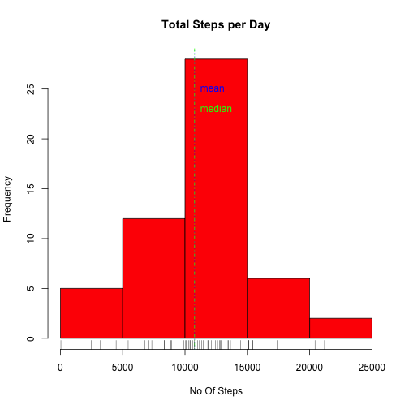
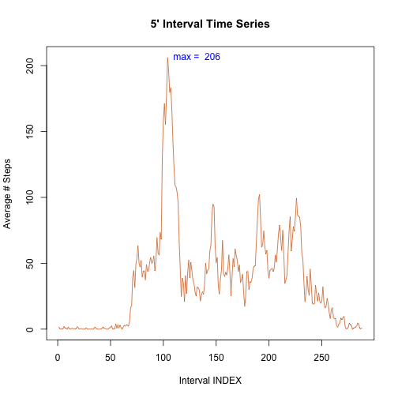
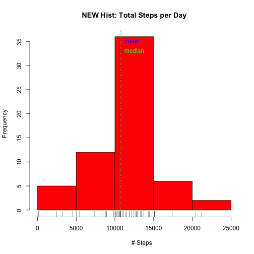

**Loading and preprocessing the data.**


**Read the Data from the zip file.**


```r
unzip("repdata_data_activity.zip")
activity<-read.csv("activity.csv") ##,stringsAsFactors=FALSE
```

**Now the NA missing values should be ignored from the data.**


```r
StepsPrsnt <- complete.cases(activity)
nMissing <- length(StepsPrsnt[StepsPrsnt==FALSE])
nComplete <- length(StepsPrsnt[StepsPrsnt==TRUE])
```

**Now remove the missing values from the data set.**


```r
stepsComplete<-subset(activity,complete.cases(activity)==TRUE)
```

**What is mean total number of steps taken per day?**


```r
splitByDay<-split(stepsComplete,stepsComplete$date, drop=TRUE)
dailySteps<-sapply(splitByDay, function(x) sum(x$steps))
print(summary(dailySteps))
```

```
##    Min. 1st Qu.  Median    Mean 3rd Qu.    Max. 
##      41    8841   10760   10770   13290   21190
```

```r
print(mean(dailySteps))
```

```
## [1] 10766.19
```

```r
print(median(dailySteps))
```

```
## [1] 10765
```

**Make a histogram of the total number of steps taken each day.**


```r
hist(dailySteps, main="Total Steps per Day", xlab="No Of Steps", col="red")
abline(v=mean(dailySteps), lty=3, col="blue") 
abline(v=median(dailySteps), lty=4, col="green")
text(mean(dailySteps),25,labels="mean", pos=4, col="blue")
##text(mean(dailySteps),23,labels="median", pos=4, col="red") 
text(median(dailySteps),23,labels="median", pos=4, col="green") 
rug(dailySteps, col="black") 
```

 

**What is the average daily activity pattern?**

* The time-series plot is computed by having 5-minute interval (x-axis) and the average number of steps taken, averaged across all days (y-axis)


```r
splitByInterval <- split(stepsComplete,stepsComplete$interval, drop=TRUE)
avgInterval <- sapply(splitByInterval, function(x) mean(x$steps))
plot(avgInterval, type="l",  
     main="5' Interval Time Series", 
     ylab="Average # Steps", 
     xlab="Interval INDEX", col="chocolate") 
text(which.max(avgInterval),max(avgInterval),  
     labels=paste("max = ",as.character(round(max(avgInterval)))), 
     pos=4, col="blue") 
```

 

**5-minute interval which contains the maximum number of steps.**


```r
print(names(which.max(avgInterval)))
```

```
## [1] "835"
```

```r
print(round(max(avgInterval)) )
```

```
## [1] 206
```

**Imputing missing values.**


**The missing values will be imputed using the mean across all days for the 5-minute interval.**


```r
newActivity <- cbind(activity,StepsPrsnt) # newData, with 'StepsPrsnt' column  
splitByOrig<-split(newActivity,newActivity$StepsPrsnt, drop=TRUE) 
for (row in 1:nrow(splitByOrig[["FALSE"]])){  
  v<-match(as.character(splitByOrig[["FALSE"]][row,3]),names(avgInterval))
  splitByOrig[["FALSE"]][row,1] <- round(avgInterval[v])
}
newActivity <- rbind(splitByOrig[["FALSE"]],splitByOrig[["TRUE"]])# combine the TRUE & FALSE data frames  
newActivity <- newActivity[with(newActivity, order(date, interval)), ] 
```

**Make a histogram of the total number of steps taken each day with the new data set.**


```r
splitNewByDay <- split(newActivity,newActivity$date, drop=TRUE)# split the newActivity by date  
dailyStepsNew <- sapply(splitNewByDay, function(x) sum(x$steps))  
hist(dailyStepsNew, main="NEW Hist: Total Steps per Day", xlab="         # Steps", col="red") 
# plot a histogram  
abline(v=mean(dailySteps), lty=3, col="blue") # draw a blue line thru the mean  
abline(v=median(dailySteps), lty=4, col="green")  # draw a green line thru the median  
text(mean(dailySteps),35,labels="mean", pos=4, col="blue") # label the mean  
text(median(dailySteps),33,labels="median", pos=4, col="green") # label the median  
rug(dailyStepsNew,col="black")
```

 

**Summary,Mean and Median of new daily steps after imputing the missing values.**

* There is not much difference in these values when compared to ignoring NA values.

**The difference is in the frequency of the centre bar of the histogram. In the new
histogram the frequency is higher as compared to the frequency of the old histogram 
which ignored missing values.**


```r
print(summary(dailyStepsNew))
```

```
##    Min. 1st Qu.  Median    Mean 3rd Qu.    Max. 
##      41    9819   10760   10770   12810   21190
```

```r
print(mean(dailyStepsNew))
```

```
## [1] 10765.64
```

```r
print(median(dailyStepsNew))
```

```
## [1] 10762
```

**Are there differences in activity patterns between weekdays and weekends?.**

**Now let us consider activity patterns between weekdays and weekends.**

* First create a factor variable and then create a panel plot of the 5-minute interval (x-axis) and the average number of steps taken, averaged across all weekday days or weekend days (y-axis).


```r
newActivity$date <- as.Date(strptime(newActivity$date, format="%Y-%m-%d")) 
# convert date to a date() class variable  
newActivity$day <- factor(format(newActivity$date, "%A")) 
levels(newActivity$day) <- list(weekday = c("Monday", "Tuesday",
                                             "Wednesday", 
                                             "Thursday", "Friday"),
                                 weekend = c("Saturday", "Sunday"))
levels(newActivity$day)
```

```
## [1] "weekday" "weekend"
```

```r
## aggregate newData by steps as a function of interval + day  
stepsByDay <- aggregate(newActivity$steps ~ newActivity$interval + newActivity$day, newActivity, mean)

## rename  the column names.
names(stepsByDay) <- c("interval", "day", "steps")
library(lattice)
p<-xyplot(stepsByDay$steps ~ stepsByDay$interval | stepsByDay$day, 
       layout = c(1, 2), type = "l", 
       xlab = "Interval", ylab = "Number of steps")
print(p)
```

 
